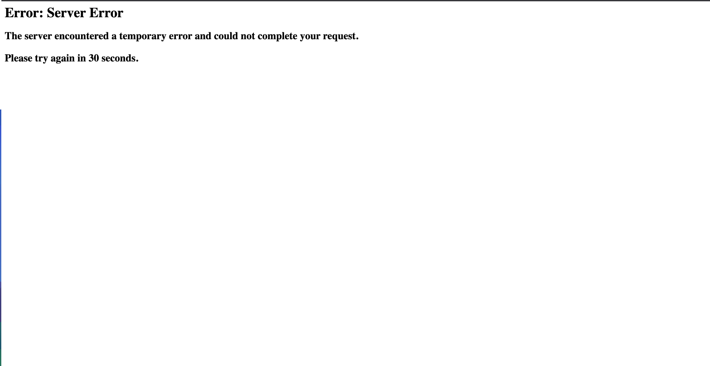
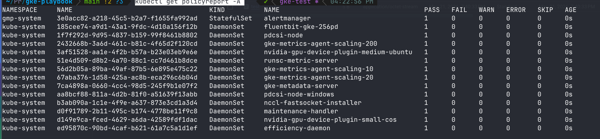

# Day 2 — Security

Welcome to Day 2 of the GKE Playbook. Today is about securing the cluster: locking down traffic between workloads, adding admission-time guardrails, and removing hardcoded secrets.

Goals for the day:

- Set up **Network Policies** (least-privilege pod-to-pod traffic)
- Set up an **Admission Controller** (Kyverno: validating + mutating policies)
- Set up **Secret Management** (Google Secret Manager via the CSI driver, no hardcoded secrets)

## Network Policy

By default Kubernetes allows all pod-to-pod traffic. NetworkPolicies let us restrict it. One catch: a plain Kubernetes cluster doesn't *enforce* NetworkPolicy on its own — you need a network-policy provider in the dataplane. On GKE that's either **Calico** (the legacy dataplane) or **Cilium** (Dataplane V2). This cluster enables **Calico** via `network_policy` in `cluster.tf`, so the policies below are actually enforced.

NetworkPolicy has two directions:

- **Ingress** — traffic coming *into* a pod
- **Egress** — traffic leaving a pod

For this project we focus on **ingress** only (egress stays open, so DNS and outbound calls keep working without extra rules).

### Default deny

Start with a default-deny policy that blocks all ingress in the namespace. Once applied, the app breaks — every service is now unreachable from its callers:



### Allow per dependency

Next, add the traffic back **one allow-rule per real dependency**. The dependency graph comes straight from each service's `*_ADDR` environment variables (e.g. `frontend` calls `productcatalogservice`, `checkoutservice` fans out to six backends, `cartservice` talks to `redis-cart`). Each arrow in that graph becomes an ingress rule naming the allowed caller and port.

Two cases that need special handling:

- **frontend** is hit by the GCE load balancer, so besides `loadgenerator` it must allow Google's health-check ranges `130.211.0.0/22` and `35.191.0.0/16`, or the Ingress backend goes unhealthy.
- **emailservice** is reached on pod port `8080` (the Service remaps `5000 → 8080`), so the allow rule uses `8080`.

The full policy set lives in `k8s-manifest/`. Apply it and watch `loadgenerator` return to 200s.

## Admission Controller

An admission controller is an additional guardrail: it intercepts requests to the API server and can enforce policies before objects are persisted. For this project we use **Kyverno**.

Kyverno supports two policy types:

- **Validating** — accept or reject a request
- **Mutating** — modify a request before it's stored

### Validating policy

We start with a validating policy called `disallow-latest-tag`, which blocks images using the `:latest` tag (or an untagged image).

Install Kyverno:

```bash
kubectl create -f k8s-manifest/security/kyverno/install.yaml
```

Verify it's running:

```bash
kubectl get pods -n kyverno
```

Create the policy in **Audit** mode first — this reports violations without blocking, so you can confirm the policy won't break the cluster:

```bash
kubectl create -f k8s-manifest/security/kyverno/validating-policy.yaml
```

Check for violations:

```bash
kubectl get policyreport -A
```



Confirm there are no failures, then simulate a violation:

```bash
kubectl run nginx --image=nginx:latest
```

Look for the violation:

```bash
kubectl get policyreport -A | grep "nginx"
```

You'll see it flagged. Now switch the policy to **Enforce** mode:

```yaml
spec:
  validationFailureAction: Enforce
```

Try creating the `:latest` pod again — this time it's rejected:

```bash
Error from server: admission webhook "validate.kyverno.svc-fail" denied the request:

resource Pod/default/nginx was blocked due to the following policies

disallow-latest-tag:
  validate-image-tag: 'validation error: Using '':latest'' or an untagged image is
    not allowed; pin an explicit tag. rule validate-image-tag failed at path /spec/containers/0/image/'
```

### Mutating policy

Next a mutating policy: it adds the label `owner: default` to a pod **if the label isn't already present** (Kyverno's `+(owner)` "add if not present" anchor).

```bash
kubectl create -f k8s-manifest/security/kyverno/mutating-policy.yaml
```

Create a pod with no `owner` label:

```bash
kubectl run nginx --image=nginx:1.18
```

Confirm the label was injected automatically:

```bash
kubectl get pods nginx --show-labels
```

That's the mutating admission controller in action — modifying objects at admission time without the user specifying anything.

## Secret Management

Goal: **no hardcoded secrets**. Grafana's admin password is stored in Google Secret Manager and delivered to the pod at runtime — it never appears in a manifest.

How the pieces fit:

1. **Secret in Secret Manager** — `grafana-password` is generated and stored by Terraform (`grafana.tf`).
2. **CSI driver** — the cluster enables the GKE-managed Secret Manager CSI driver (`secret_manager_config` in `cluster.tf`). Driver name: `secrets-store-gke.csi.k8s.io`.
3. **Workload Identity** — the Grafana KSA (`monitoring/grafana`) is annotated with the GCP SA email, and that SA is granted `secretmanager.secretAccessor` **on just this secret**. The CSI driver fetches the secret *as that SA*.
4. **SecretProviderClass** (`provider: gke`) — tells the driver to fetch `grafana-password` and mount it as a file at `/mnt/secrets-store/admin-password`.
5. **Grafana reads the file** — via `GF_SECURITY_ADMIN_PASSWORD__FILE`, Grafana reads the password directly from the mounted file. (The GKE-managed driver only mounts files; it doesn't sync to a K8s Secret, so we read the file rather than use `secretKeyRef`.)

The project ID is kept as a `${PROJECT_ID}` placeholder in the manifest and injected at apply time, so nothing is hardcoded:

```bash
export PROJECT_ID=$(gcloud config get-value project 2>/dev/null)
envsubst < k8s-manifest/monitoring/grafana.yaml | kubectl apply -f -
```

Verify the pod mounted the secret and Grafana came up:

```bash
kubectl get pods -n monitoring -l app=grafana
kubectl exec -n monitoring deploy/grafana -- ls -l /mnt/secrets-store/
```

Access Grafana via port-forward:

```bash
kubectl port-forward -n monitoring svc/grafana 3000:3000
```

Then open http://localhost:3000 — user `admin`, password from:

```bash
gcloud secrets versions access latest --secret=grafana-password
```
